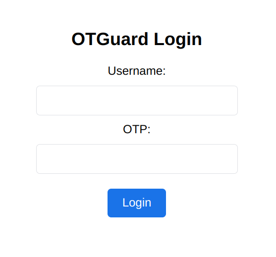
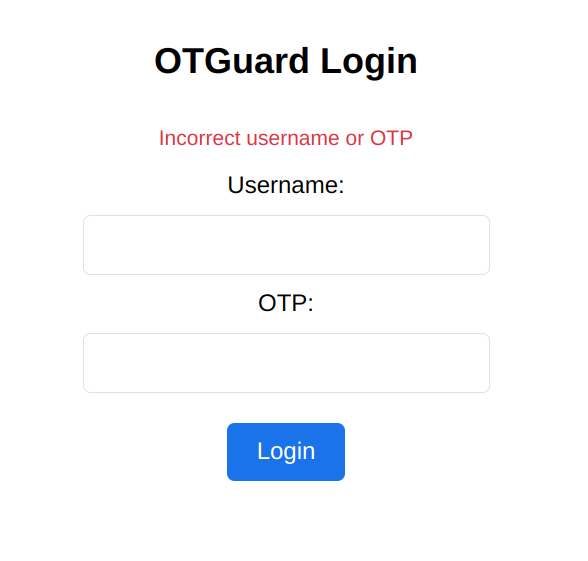
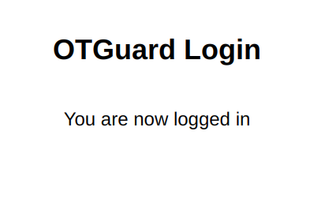

# 🛡️ OTGuard

OTGuard is a tool for providing two-factor authentication with zero
configuration on services that have single-factor authentication and do not
integrate with any 2FA solution. It is not meant to be used in isolation but is
intended to be part of a defense in depth strategy where applications listening
on the ports have their own authentication. OTGuard aims to provide a small
attack surface with only ~ 300 lines of code and uses privilege separation.

One of the key benefits of OTGuard is that it is the only solution that works
with applications that expect direct access to services, such as Jellyfin and
Nextcloud. While it is not a replacement for Identity Aware Proxies or SSO, it
aims to provide 2FA with zero configuration on services.

OTGuard is the second factor in 2FA, and it is expected that services provide
the first factor with usernames and passwords. The tool uses OTP codes, which
makes it less vulnerable to replay attacks. All firewall rules are reset daily
to provide some security against compromised devices. Users will need to
authenticate every day, and this reduces the amount of code and the attack
surface even further.

The workflow for OTGuard is simple. Users try to access a service, and if it
does not work, they log in on OTGuard. Once authenticated, users will have
access to the desired service. The tool does not check whether the user is
already allowed or use cookies as it seems like unnecessary complexity.

OTGuard is inspired by solutions like port knocking or Fwknop but unlike port
knocking, passwords are not sent in the clear, and unlike Fwknop, it provides
OTP codes so that passwords cannot be reused.

## Disclaimer

OTGuard is currently on alpha. Take your time to understand its intended use and do not use it on production systems for now unless you are keen to go through all the code and ensure it meets your security requirements.

## Install

To install: download and extract  the tarball. Then run the install command which will guide you through the installation.

```
$ wget https://github.com/cristianrz/otguard/releases/download/230324/otguard-230324.tgz
$ tar xzvf otguard-*.tgz
# ./install
```

The install process will create a certificate and a TOTP secret for you.

## Usage

- First, store your TOTP secret in your preferred TOTP generator (I recommend KeePassXC)

- Enable the OTGuard service

```
# systemctl enable --now otguard
```

- Ensure first that your site is inaccessible from the internet.

- If you go on `https://your.website` you shouldn't see  anything.

- Ensure you have firewall rules to allow traffic on port 8443 (by default) for OTGuard, for example

```
# iptables -I INPUT -p tcp -m tcp --dport 8443 -j ACCEPT 
```

- Now head onto `https://your.website:8443`:

<center></center>

- Try to put a random user and code:

<center></center>

- Put the correct TOTP:

<center></center>

- Now if you go back to `https://your.website` you should have access to it.

- If you check `iptables` you can see what rules OTGuard created:

```
# iptables -S | grep otguard
-A INPUT -s 10.10.10.1/32 -p tcp -m tcp --dport 80 -m comment --comment otguard -j ACCEPT
-A INPUT -s 10.10.10.1/32 -p tcp -m tcp --dport 443 -m comment --comment otguard -j ACCEPT
```

- Rules are purged daily. A cron file is installed in `/etc/cron.d` that does it. Feel free to amend as necessary. Rules can also be purged manually with

```
# /usr/local/otguard/bin/otguard-purgerules
```

- If you check again there should be no otguard rules:

```
# iptables -S | grep otguard
-A INPUT -s 10.10.10.1/32 -p tcp -m tcp --dport 80 -m comment --comment otguard -j ACCEPT
-A INPUT -s 10.10.10.1/32 -p tcp -m tcp --dport 443 -m comment --comment otguard -j ACCEPT
```

## Configuration

The default install uses a self-signed certificate and a randomly generated secret.

To install a new certificate you can replace `key.pem` and `cert.pem` in `/etc/otguard`.

To add, remove or change users you can edit `/etc/otguard/secrets`. Each user should be a new line in the form of `<username>:<secret>`.
